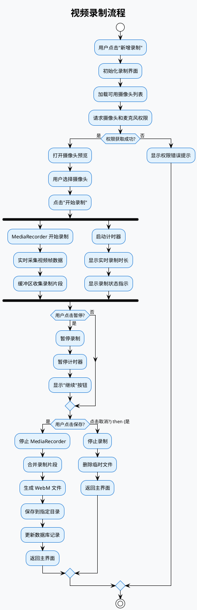
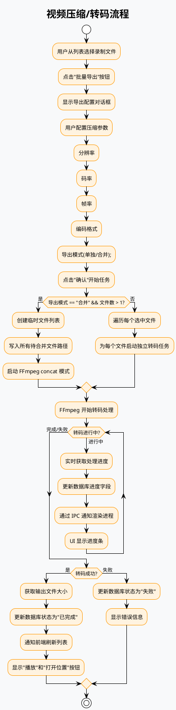
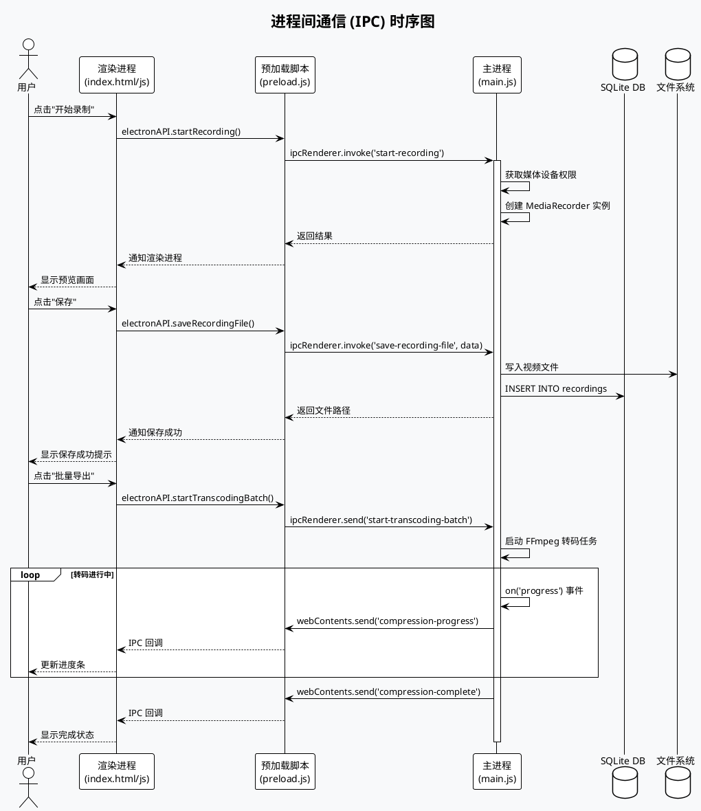
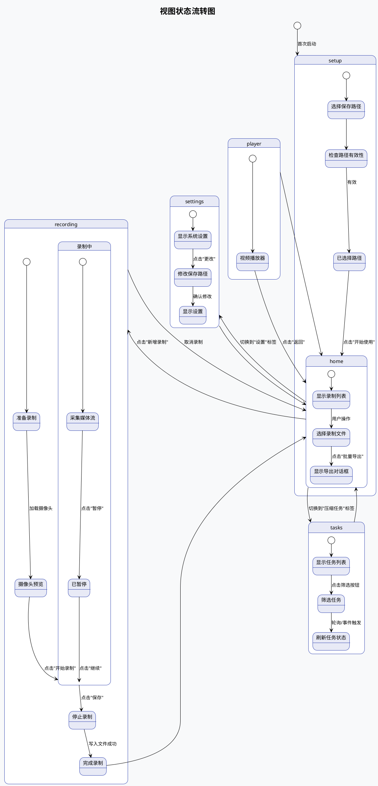

# minisize record - 儿童课文背诵视频录制工具

## 项目背景与目标

minisize record 是一款专为儿童教育场景设计的桌面视频录制与压缩工具。该软件解决的核心问题是：家长需要为孩子录制背诵课文的音视频作业，但手机录制生成的视频文件体积过大，上传困难。通过调用电脑的摄像头和麦克风，结合 FFmpeg 强大的视频处理能力，本应用支持多种参数配置（帧率、分辨率、视频编码方式、码率等），能够在保证基本画质的前提下大幅减小视频文件体积，方便作业上传和分享。

## 技术架构总览

本项目采用经典的 **Electron 桌面应用架构**，实现了渲染进程与主进程分离的设计模式，充分利用了 Web 技术栈的开发效率，同时具备原生桌面应用的系统访问能力。

### 技术栈详情

| 技术 | 版本要求 | 作用说明 |
|------|----------|----------|
| **Electron.js** | ^28.0.0 | 桌面应用框架，负责 UI 渲染、窗口管理、系统原生 API 调用 |
| **Node.js** | (随 Electron 捆绑) | 提供文件系统操作、子进程管理、数据库访问等后端能力 |
| **fluent-ffmpeg** | ^2.1.2 | Node.js 封装的 FFmpeg 命令行工具，简化转码参数配置 |
| **ffmpeg-static** | ^5.3.0 | 提供跨平台的 FFmpeg 可执行文件，无需用户单独安装 |
| **better-sqlite3** | ^9.4.3 | 同步 SQLite3 数据库 driver，用于持久化存储录制记录和任务信息 |
| **electron-builder** | ^24.9.1 | 跨平台打包工具，支持生成 macOS DMG/ZIP、Windows NSIS、Linux 等安装包 |

### 架构设计原则

1. **进程隔离**：渲染进程（UI）与主进程（系统操作）分离，保证应用稳定性
2. **安全通信**：通过 IPC 机制和 contextBridge 实现进程间安全通信
3. **状态持久化**：使用 SQLite 数据库存储录制元数据，应用重启后状态不丢失
4. **资源自包含**：FFmpeg 二进制文件打包进应用，无需外部依赖

---

## 项目结构

```
minisize-record/
├── package.json              # 项目配置、依赖声明、构建脚本
├── src/
│   ├── main/
│   │   └── main.js          # Electron 主进程入口，处理系统级操作
│   ├── preload.js            # 渲染进程桥接脚本，安全暴露 API 给前端
│   └── renderer/
│       ├── index.html       # 主界面模板
│       ├── css/style.css     # 样式文件
│       └── js/renderer.js   # 渲染进程逻辑，UI 交互和数据展示
├── build/                     # 应用图标资源
├── resources/                 # 运行时资源目录
│   └── bin/                   # 平台相关的 FFmpeg 二进制文件
└── dist/                      # 构建输出目录
```

---

## 系统架构图

```plantuml
@startuml minisize-record-architecture
!theme plain
skinparam backgroundColor #F8F9FA
skinparam componentStyle rectangle
skinparam defaultTextAlignment center
skinparam packageStyle rectangle

title minisize record 系统架构图

package "操作系统层" {
    [文件系统]
    [摄像头/麦克风]
    [数据库引擎]
}

package "Electron 主进程 (Node.js)" as MainProcess {
    [BrowserWindow] : 窗口管理
    [IPC Main] : 进程间通信
    [FFmpeg Handler] : 视频转码引擎
    [SQLite Database] : 数据持久化
    [Native Dialogs] : 系统对话框
}

package "Electron 渲染进程 (Chromium)" as RendererProcess {
    [UI Components] : 界面组件
    [MediaRecorder API] : 媒体录制
    [View Manager] : 视图切换
    [Task Manager] : 任务管理
}

cloud "外部资源" {
    [FFmpeg Binary] : 静态二进制文件
}

' 关系定义
MainProcess --> "操作系统层" : 系统调用
MainProcess --> "FFmpeg Binary" : 执行转码命令
RendererProcess --> MainProcess : IPC 通信
RendererProcess --> "MediaRecorder API" : 录制视频流

@enduml
```

---

## 核心功能模块

### 1. 视频录制模块

使用浏览器原生 **MediaRecorder API** 采集摄像头和麦克风的媒体流，支持 WebM 格式的高效录制。

**功能特性**：
- 实时摄像头预览
- 多摄像头设备切换
- 录制控制：开始、暂停、继续、停止
- 实时录制时长显示
- 录制状态视觉指示

### 2. 视频压缩模块

基于 **FFmpeg** 的强大转码能力，支持多种压缩配置。

**支持的参数**：
| 参数 | 可选值 | 说明 |
|------|--------|------|
| 分辨率 | 原始 / 1920×1080 / 1280×720 / 854×480 / 640×360 | 输出视频尺寸 |
| 帧率 | 60 / 30 / 24 / 15 fps | 每秒帧数，越低文件越小 |
| 码率 | 2000k / 1000k / 500k / 200k / 100k kbps | 视频比特率 |
| 编码格式 | H.264 / H.265 (HEVC) | 视频编码器，H.265 压缩率更高 |
| 导出模式 | 逐个导出 / 合并导出 | 批量处理模式 |

### 3. 任务管理模块

使用 **SQLite 数据库** 持久化管理录制记录和压缩任务。

**数据模型**：
- **recordings 表**：存储录制文件元信息
- **compression_tasks 表**：存储压缩/转码任务状态和进度

---

## 数据流程图

### 视频录制流程



### 视频压缩流程



---

## 进程通信机制



---

## 数据库设计

### recordings 表

| 字段 | 类型 | 说明 |
|------|------|------|
| id | INTEGER | 主键，自增 |
| filename | TEXT | 文件名 |
| file_path | TEXT | 完整文件路径 |
| duration | INTEGER | 录制时长（秒） |
| file_size | INTEGER | 文件大小（字节） |
| status | TEXT | 状态：pending/completed |
| transcoding_status | TEXT | 转码状态 |
| transcoding_progress | INTEGER | 转码进度 |
| created_at | DATETIME | 创建时间 |
| camera_name | TEXT | 使用的摄像头名称 |
| resolution | TEXT | 分辨率 |
| frame_rate | INTEGER | 帧率 |

### compression_tasks 表

| 字段 | 类型 | 说明 |
|------|------|------|
| id | INTEGER | 主键，自增 |
| recording_id | INTEGER | 关联的录制文件 ID |
| output_path | TEXT | 输出文件路径 |
| config | TEXT | JSON 格式的压缩配置 |
| status | TEXT | 状态：pending/processing/completed/failed |
| progress | INTEGER | 处理进度 |
| created_at | DATETIME | 创建时间 |
| completed_at | DATETIME | 完成时间 |
| output_size | INTEGER | 输出文件大小 |

---

## 视图状态管理



---

## 快速开始

### 环境要求

- **操作系统**：macOS 10.13+ / Windows 7+ / Linux (需测试)
- **Node.js**：随 Electron 捆绑，无需单独安装
- **系统权限**：首次启动需要摄像头和麦克风权限

### 开发环境

```bash
# 1. 克隆项目
git clone <repository-url>
cd minisize-record

# 2. 安装依赖
npm install

# 3. 启动开发版本
npm start
```

### 构建发布版本

```bash
# 构建 macOS DMG 安装包
npm run build

# 可选：构建其他平台
# macOS ARM64: npm run build -- --mac --arm64
# Windows NSIS: npm run build -- --win
```

### 构建配置说明

package.json 中的 `build` 配置：
```json
{
  "appId": "com.minisize.record",
  "productName": "minisize record",
  "directories": {
    "output": "dist"
  },
  "files": ["src/**/*"],
  "asarUnpack": ["**/node_modules/better-sqlite3/*"],
  "extraResources": [{
    "from": "resources/bin/${os}",
    "to": "bin",
    "filter": ["**/*"]
  }]
}
```

---

## 默认参数配置

| 参数 | 默认值 | 可选范围 | 对文件大小的影响 |
|------|--------|----------|------------------|
| 分辨率 | 1280×720 | 1920×1080 / 1280×720 / 854×480 / 640×360 | 分辨率越高，文件越大 |
| 帧率 | 24 fps | 60 / 30 / 24 / 15 | 帧率越高，文件越大 |
| 视频码率 | 2000k | 2000k / 1000k / 500k / 200k / 100k | 码率越高，画质越好，文件越大 |
| 编码格式 | H.264 | H.264 / H.265 | H.265 压缩率比 H.264 高约 40% |
| 压缩质量(CRF) | 23 | 0-51 | 值越低画质越好，值越高体积越小 |

---

## 使用指南

### 首次设置

1. 启动应用后，系统会引导你选择视频保存文件夹
2. 首次使用需要授权摄像头和麦克风访问权限
3. 设置完成后会自动进入主界面

### 录制新视频

1. 点击 **"新增录制"** 按钮进入录制界面
2. 从下拉菜单选择要使用的摄像头
3. 点击 **"开始录制"** 开始捕捉视频
4. 录制过程中可点击 **"暂停"** 暂停，**"继续"** 恢复
5. 点击 **"保存录像"** 完成录制并保存到指定目录

### 批量压缩/导出

1. 在主界面勾选要处理的一个或多个录制文件
2. 点击 **"批量导出"** 按钮
3. 在弹出的对话框中配置输出参数：
   - 选择导出模式（逐个单独导出 / 合并为一个视频）
   - 选择目标分辨率、码率、帧率、编码格式
4. 点击 **"继续"** 开始处理
5. 切换到 **"压缩任务"** 标签查看进度

### 查看和管理

- **播放**：点击录制卡片上的"播放"按钮预览视频
- **打开位置**：在文件管理器中定位视频文件
- **删除**：删除不再需要的录制文件或任务

---

## 目录结构说明

| 目录/文件 | 用途 |
|-----------|------|
| `src/main/main.js` | Electron 主进程入口，处理 IPC、数据库、FFmpeg 调用 |
| `src/preload.js` | 预加载脚本，定义渲染进程可调用的安全 API |
| `src/renderer/index.html` | 主界面 HTML 模板 |
| `src/renderer/js/renderer.js` | 渲染进程核心逻辑，UI 交互和数据处理 |
| `src/renderer/css/style.css` | 应用样式文件 |
| `resources/bin/mac/` | macOS 平台 FFmpeg 二进制文件 |
| `resources/bin/win/` | Windows 平台 FFmpeg 二进制文件 |
| `dist/` | 构建输出目录，包含打包后的安装文件 |

---

## 技术亮点

1. **跨平台兼容**：通过 electron-builder 支持 macOS (x64/arm64)、Windows (x64/ia32)、Linux
2. **资源自包含**：FFmpeg 二进制文件随应用分发，无需用户额外安装
3. **高效的压缩算法**：支持 H.265 (HEVC) 编码，相比 H.264 可节省约 40% 存储空间
4. **批量处理**：支持多个视频合并导出，提高作业整理效率
5. **本地数据库**：SQLite 实现数据持久化，管理录制历史和任务状态
6. **安全的 IPC 通信**：通过 contextBridge 暴露必要 API，防止渲染进程滥用系统权限

---

## 常见问题

**Q: 录制时听不到声音？**
A: 请确保系统麦克风权限已授权，并检查系统音量设置。

**Q: 压缩后的视频画质模糊？**
A: 可以尝试调高码率（如 2000k）或降低 CRF 值（数值越小画质越好）。

**Q: 支持哪些视频格式输出？**
A: 默认输出 MP4 格式，使用 WebM 录制后可转码为 MP4。

**Q: 如何调整保存路径？**
A: 进入"设置"标签，点击"更改"按钮选择新目录。

---

## 版本历史

| 版本 | 更新内容 |
|------|----------|
| 1.0.0 | 初始版本发布，支持视频录制、压缩、批量导出 |

---

## 许可证

MIT License

---

## 贡献者

感谢所有为这个项目做出贡献的人！
